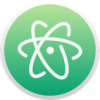

# Atom text editor
{: .fs-8 }

How to set up and use Atom for writing markdown
{: .fs-6 .fw-300 }

---

Atom is my fave editor for all types of "code". Python, bash, markdown, html... I've not tried with LaTeX, but I wouldn't be surprised if it can handle that. My guess is it probably can't handle MATLAB, but that's cool.

## Why I love Atom

What I particularly love about Atom is that I can switch between different languages very comfortably), and Atom takes care of everything the same way, no matter what you are writing. It handles the colours, the spacing, the formatting, [linting](https://en.wikipedia.org/wiki/Lint_(software)), the keyboard shortcuts, autocompletions, commenting, spell checking, searching / find+replace across multiple files, all the important stuff! I guess that is what you get from an open source tool developed by and for users who write code for a living! Other tools are available which I'm sure do a great job, but this is the one I am most comfortable with and consistently pleased by.

## Why you should use Atom

To host your documentation on GitHub pages, you're going to be writing across multiple documents, and potentially in more than one language. Atom also has a directory tree on the left which enables you to navigate around your project file easily, and also do things like create, duplicate and delete files using good old point-and-click.

Atom also provides a graphical point-and-click way of committing changes to your GitHub repo. This can be useful if you're not familiar with the process, but for these tutorials we're going to stick to command line and the terminal for GitHub, because you get more informative error reports.

## How to start with Atom

Before we crack on with creating and editing documentation, I'd love for you to get familiar with working in Atom. Here's a short video which shows you how to [install and start using Atom](https://www.youtube.com/watch?v=EyG20hhON6E).

There are tones of packages you can add on to make your workflow easier, but for these tutorials you'll only need the markdown basics which come preloaded.

Thanks, Atom. We love ya.
