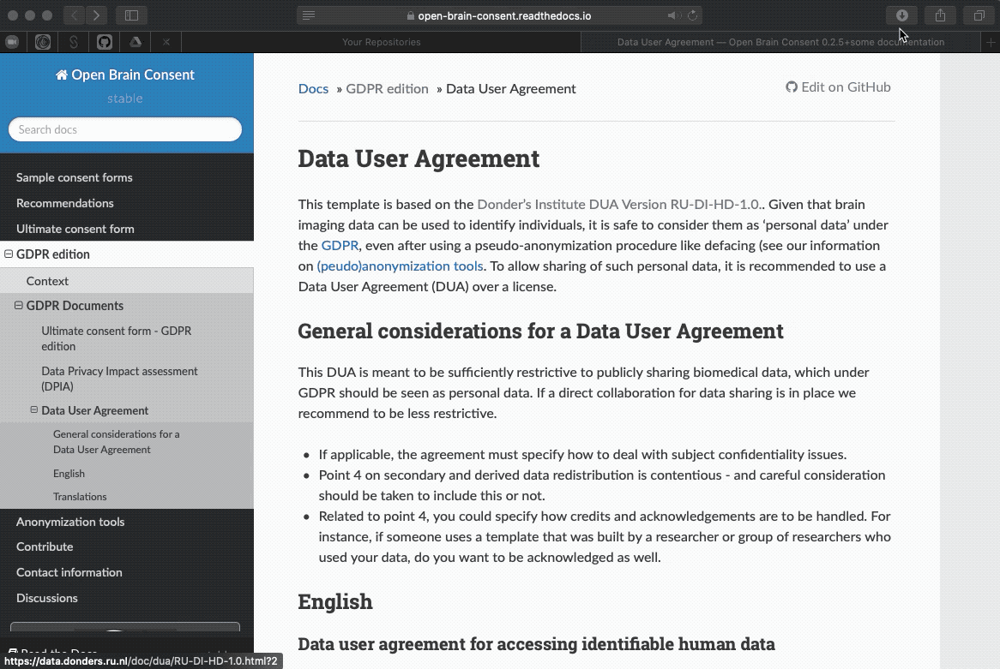
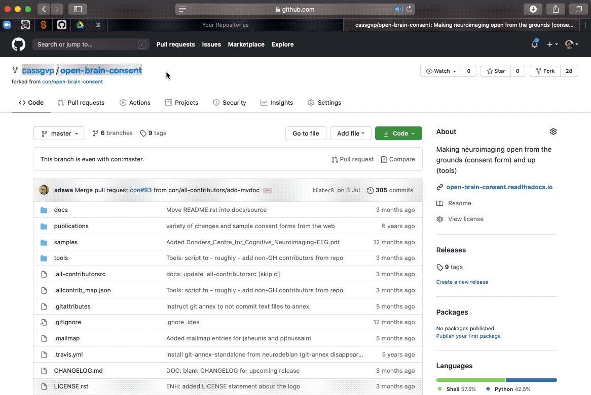
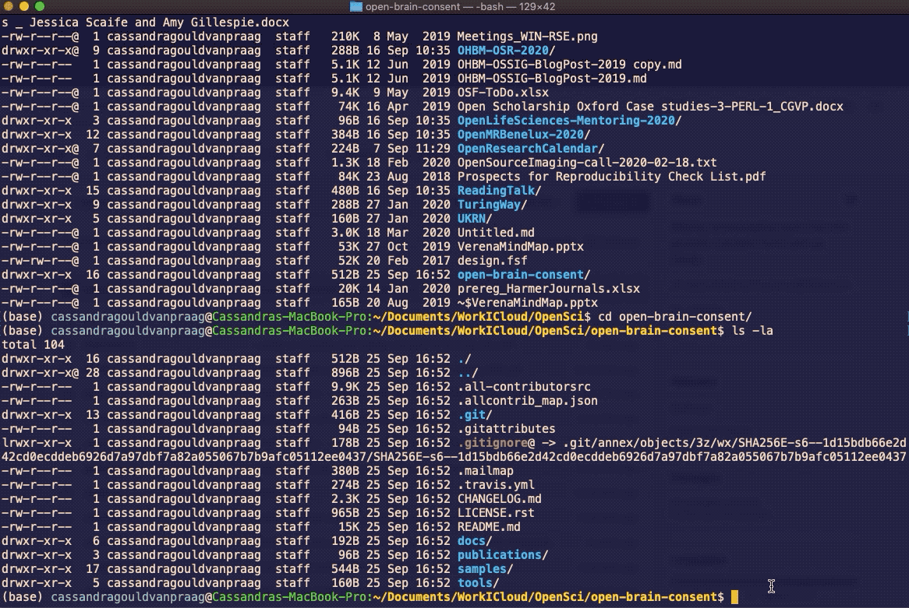

# Make a copy and submit a pull request (PR)
{: .fs-8 }

Get your own copy of someone else's material, so you can make changes and send them back for review as a pull request (PR)
{: .fs-6 .fw-300 }

---

This bit has a few stages, but git error messages and the GitHub web interface are here to help you out.

In this example I'm going to add some text to a repository that I do not own and I am not a contributor to.

For background, the repository is [Open Brain Consent](https://open-brain-consent.readthedocs.io/en/stable/index.html), which describes practical considerations and solutions relating to the open sharing of brain imaging data (my research field). I've been chatting with the repository owners, and they are expecting me to make this contribution 😊

## 1. Fork their repository

Once you have found the documentation you want to contribute to, you need to locate it on GitHub. Many sites will have a handy "Edit on GitHub" link (or something similar), particularly if they *want* you to contribute.

When you have found the GitHub repository, you need to "fork" it, to create a copy in your own GitHub account.

## 2. Clone your online copy to your local computer

Now you have an online copy of the code, you need to bring it down to your local computer with the "clone" command.

Get the https address of the repository you want to clone via the "code" button, click the "copy" button, then past the address into your command line application at the end of the command below:

`git clone [https-address]`

## 3. Create a branch

Before you start editing your local copy, it is good practice to create all your edits on a separate "branch" of the code. Creating a new branch makes a unique set of code changes with a unique name, and your branch may have multiple commits. Separating your edits onto a new branch makes it easier for the repository owner to isolate the changes you have made and integrate them into your repository with confidence.

Create your branch by entering the command below, replacing `[your-branch-name]` with something which broadly identifies the changes you are going to make.

`git checkout -b [your-branch-name]`

## 4. Make and push your changes

Now you can set about making your edit!

First confirm you are working on the new branch with the command below:

`git branch`

Then open your text editor and make and save the changes.

Finally, add, commit and save the changes as described in the earlier [git basics](2-4-git-basics.md)

Notice the git gave me a helpful error which told me that it din't know where to push my changes  - there was not "upstream branch" - and very kindly told me what commands I need to enter to set the upstream to be this branch on my copy of the repository. Thanks, Git.

## 5. Submit your pull request master

Once your changes have been pushed, GitHub online will tell you that your copy and your branch are "ahead of" (have more changes than) the original repository. You can compare the changes and submit your pull request if you are happy with them!

Note that depending on how long it has been between you forking the original repository and submitting your pull request, you may have become out of sync with the original if there has been more work done on it. Follow the instructions [here from "7. Sync your forked master branch"](https://www.freecodecamp.org/news/how-to-make-your-first-pull-request-on-github-3/) to get yourself back in sync before submitting your pull request.

## 6. Wait for your pull request to be accepted!

If you're feeling excited by all this wonderful collaboration, jump back into the original repository you cloned from, and check that the pull request is there. You can even write something nice to the repository owners, if you're feeling friendly.

Your pull request will now be reviewed by the repository owners, and you will get an email if/when it has been accepted. Now you have left a comment, you will also be notified when there are additional comments added to your thread.

Sweet! You just contributed to shared documentation! The documentation is now 1000 times better because you added your insight (maybe, probably)! You should do this more often, and help make stuff easier for other people to understand, and distribute the efforts of keeping good documentation relevant! Great job ⭐️
