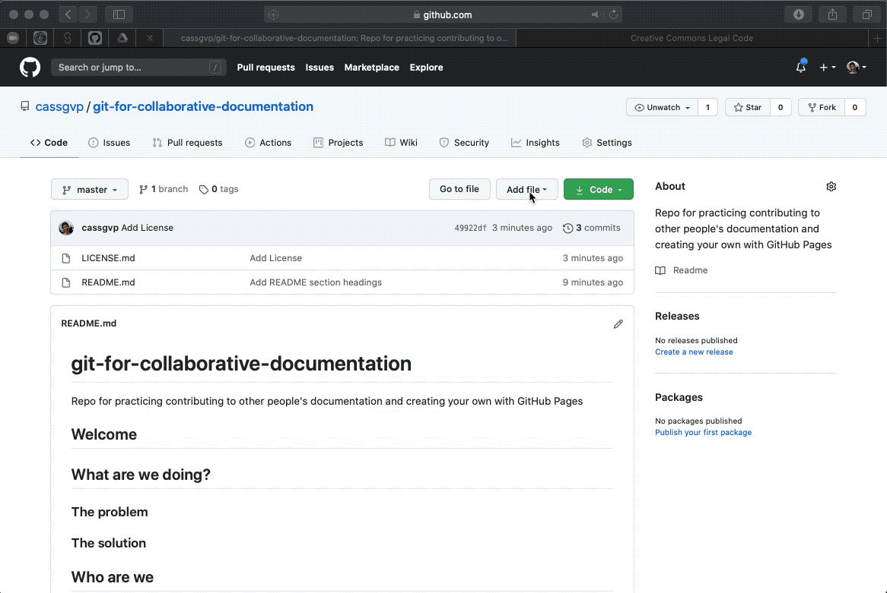

# Make a GitHub repository
{: .fs-8 }

Make your own basic documentation repository
{: .fs-6 .fw-300 }

---

## 1. Make your GitHub repository

Every GitHub pages site starts off as a simple repository.

Create a new repository for your documentation by going to your repositories and selecting "New".

Next git it a name, description, and add a README file. I've chosen not to add a license here as I have a preference for one which is not in the list of default licenses provided by GitHub.

Click "Create Repository" Ta-da! You have a repository! 🎉

## 2. Update your README.md

Your README is your landing page for your repository on GitHub. Depending on the Pages theme you chose, it may also be rendered as the "home" page on your site.

Your README should contain all the information someone needs to understand what your project is about and how they can contribute. Some suggested section headings for your README are below.

- Welcome
- What are we doing
  - The problem
  - The solution
- Who are we
- What do we need
- Contact Us
- Find out more
- Thank you

To get a quick outline of the README structure (and to differentiate it from the one automatically created by GitHub), I have chosen to edit the page in GitHub directly, and add the section headings in [Markdown](https://github.com/adam-p/markdown-here/wiki/Markdown-Cheatsheet).

To save your changes, describe what you did in the commit message, then press "commit"

## 3. Create a LICENSE.md

A license file is essential to indicate to others how you want your repository to be reused and credited.

To get the license file in place, I'm going to use the "add file" function and add a title and a link to the CC-BY legal wording.

To save your changes, describe what you did in the commit message, then press "commit"

## 4. Create a CONTRIBUTING.md

A contributing file is essential to let other know what you would like help with and how you would like people to contribute.

To get the contributing file in place, I'm going to use the "add file" function and simply add a title. I'll fill in the details later!

To save your changes, describe what you did in the commit message, then press "commit"

